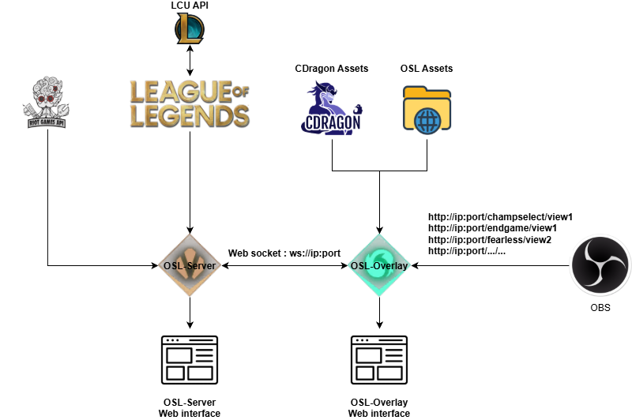
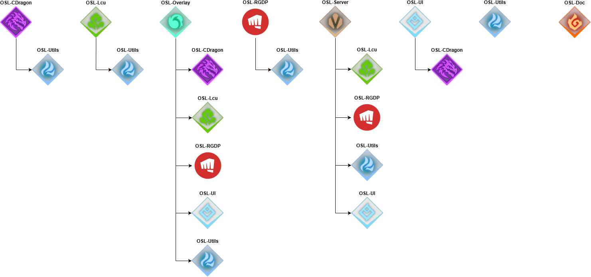
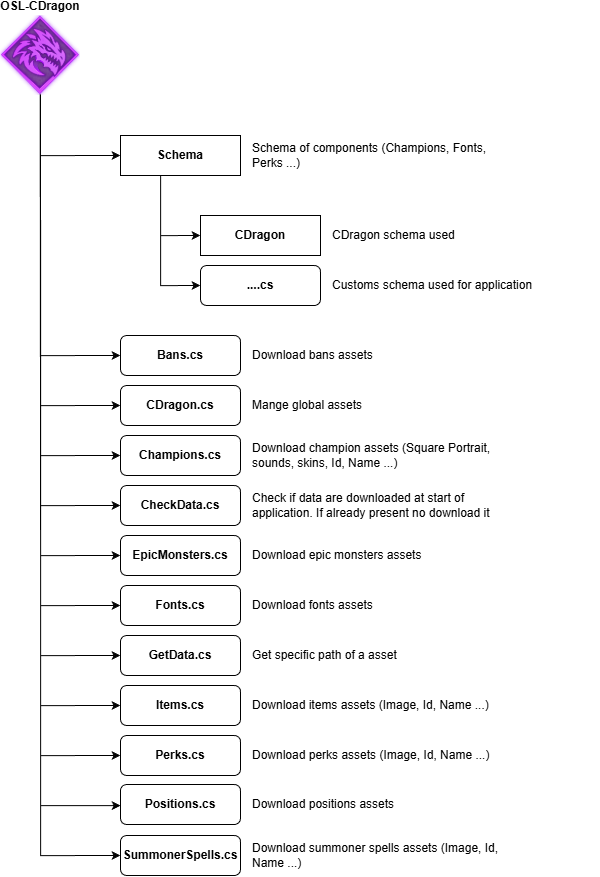
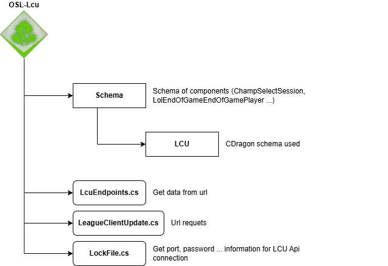
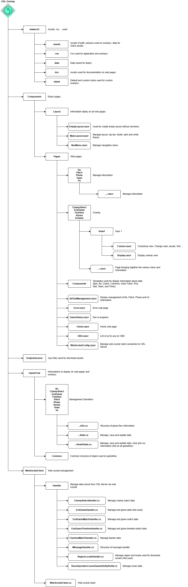
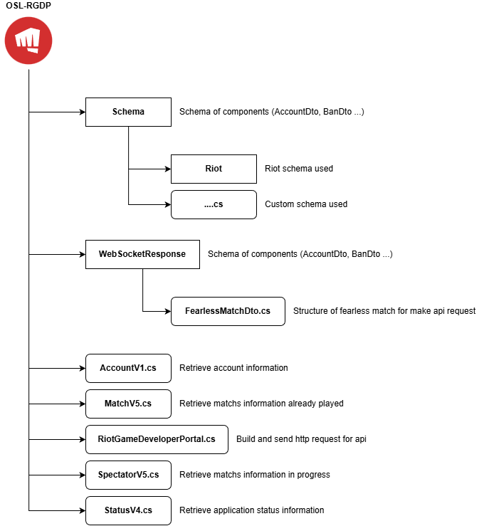
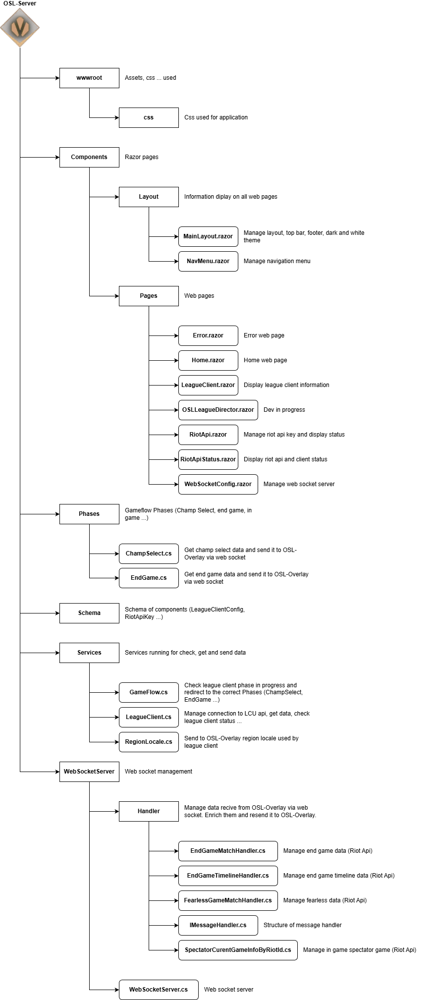
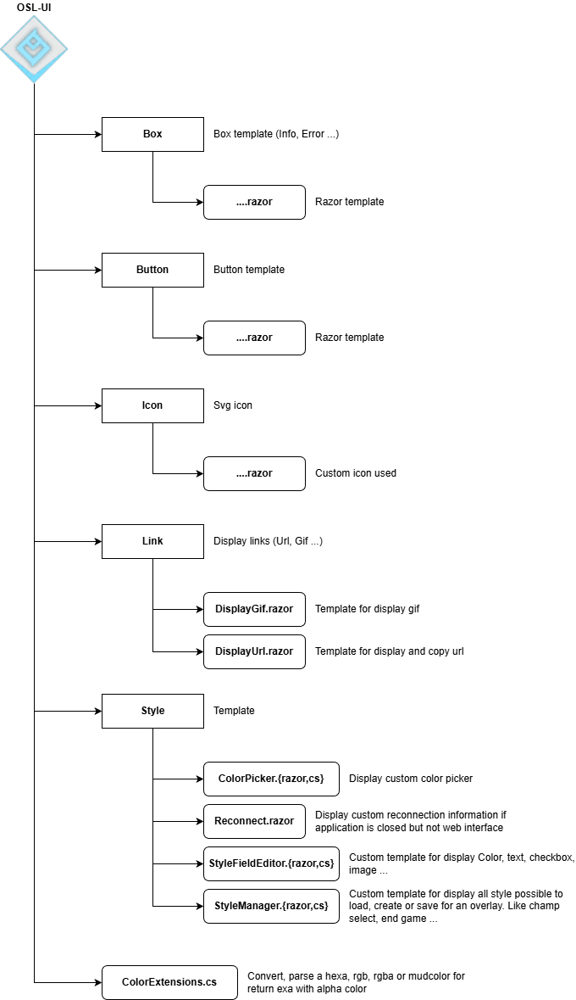
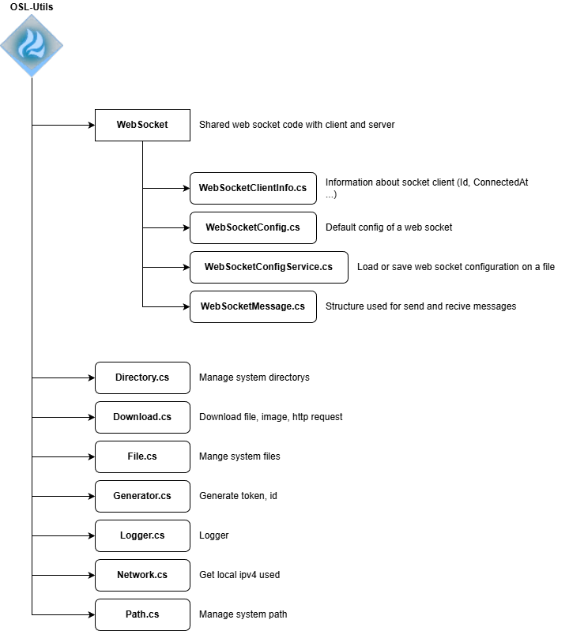

# Architecture

## General architecture

## Dependencies

## OSL-CDragon architecture

## OSL-Lcu architecture

## OSL-Overlay architecture

## OSL-RGDP architecture

## OSL-Server architecture

## OSL-UI architecture

## OSL-Utils architecture
