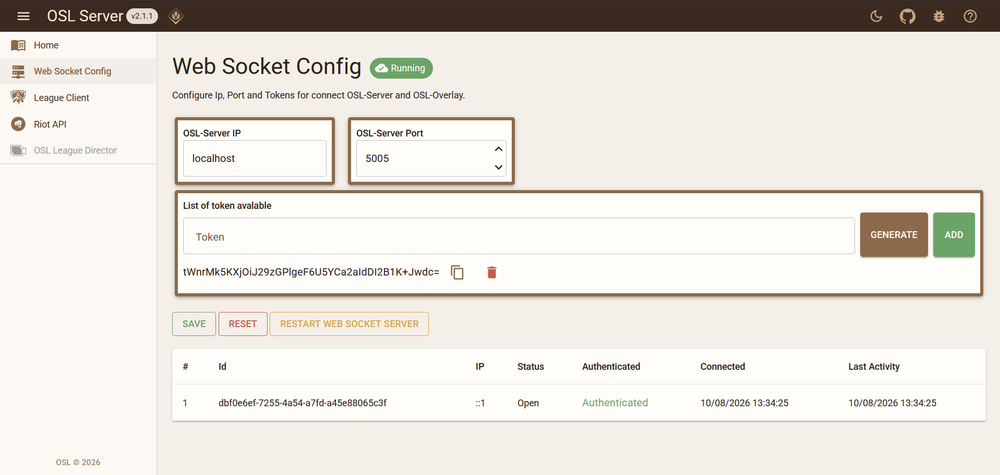
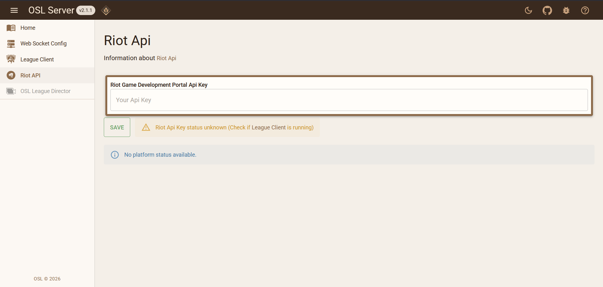
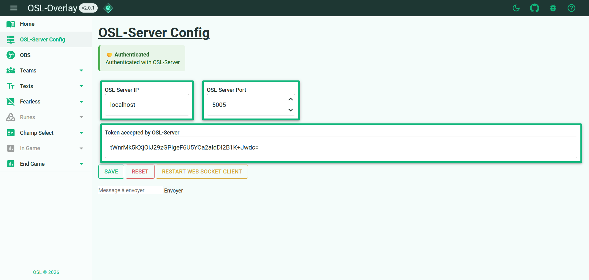

# Configuration

## **OSL-Server**
### Web socket config

- OSL-Server IP : change ip of web socket (by default is run on 0.0.0.0 even if it's noted localhost)
- OSL-Server Port : change port of web socket
- List of token avalable : add or remove tocken avalable for `OSL-Overlay` application access to `OSL-Server` web socket
- If you change many previous information clic on `Save`
- `Reset` reset modification not saved
- `Restart web socket server` if you have server or client error try to restart the web socket server 

A list of all `OSL-Overlay` application connected are display

### Riot API

Enter rout riot api key for use various features.
- Login to [riot api](https://developer.riotgames.com/apis) 
- Go to dashboard
- Clic on `GENERATE API KEY`
- Clic on `Copy`
- Copy this api key on `Riot Game Development Portal Api Key` and clic on `Save`
- If the api key doesn't work, riot api or League of Legends have same troubleshoot he is display.

## **OSL-Overlay**

### Server config

- OSL-Server IP : enter ip where `OSL-Server` is runing
- OSL-Server Port : enter port used
- Token accepted by OSL-Server : token avalable on `OSL-Server`
- If you change many previous information clic on `Save`
- `Reset` reset modification not saved
- `Restart web socket client` if you have client error try to restart the web socket client 

## **OBS**
- Go to `OBS` web pages of `OSL-Overlay`
- Copy url on `OBS application`

> [!CAUTION]
> Use only http links, not https. OSB does not support https links.

> 