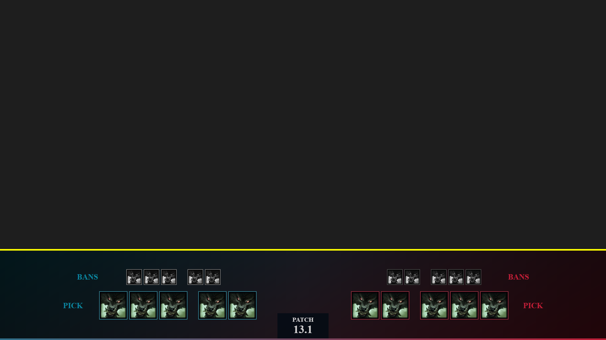
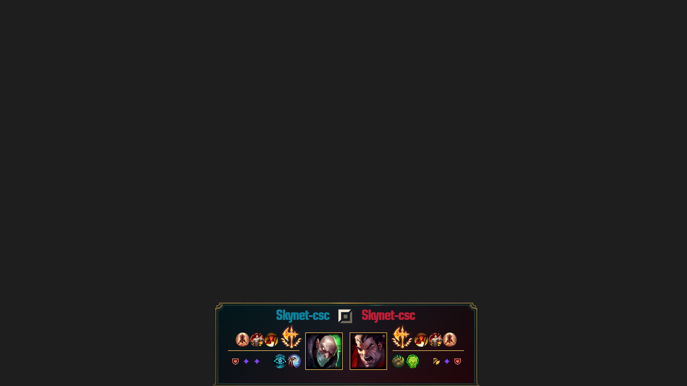

# **Web** Documentation

---

> [!CAUTION] 
> **Documentation in progress** 

---

## Run application
1. Download last release : [Release v1.1.6](https://github.com/Sky-CSC/OSL/releases/latest)
2. Unzip ``OSL-Web-1.1.6-win-x64.zip`` to desired install folder
3. Run ```OSL-Web.exe```, **Read the index web page when OSL-Web is launched**
4. Change the Web Riot Api key in the web interface configuration

[Riot Developer page (take your api key)](https://developer.riotgames.com/)
Login and copy past your "Development API Key" 


**Read the index web page when OSL-Web is launched**

---

## **OBS** configuration :
Add to your différents scènes the différents URL (change ip by your local ip)

Champ Select :

```sh
http://ip:4141/champselect/view1
http://ip:4141/champselect/view2
http://ip:4141/champselect/view3
http://ip:4141/champselect/view4
```

In Game :

```sh
http://ip:4141/ingame/view1
http://ip:4141/ingame/view2
http://ip:4141/ingame/view3
```

End Game :

```sh
http://ip:4141/endgame/view1
http://ip:4141/endgame/view2
http://ip:4141/endgame/view3
```

Runes :

```sh
http://ip:4141/runes/view1/top
http://ip:4141/runes/view1/mid
http://ip:4141/runes/view1/jungle
http://ip:4141/runes/view1/adc
http://ip:4141/runes/view1/supp
http://ip:4141/runes/view1/adcsupp
http://ip:4141/runes/view1/all
```

---

## Features, information display on pages

<input type="checkbox" disabled checked> : Feature implemented

<input type="checkbox" disabled> : Feature not implemented


### <ins>**Platform Routing Values Covered (Web Riot Api)**

| Activate | Platform | Host |
| :-------: | :-------: | :-------: |
| <input type="checkbox" disabled checked> | BR1 |	br1.api.riotgames.com |
| <input type="checkbox" disabled checked> | EUN1 |	eun1.api.riotgames.com |
| <input type="checkbox" disabled checked> | EUW1 |	euw1.api.riotgames.com |
| <input type="checkbox" disabled checked> | JP1 |	jp1.api.riotgames.com |
| <input type="checkbox" disabled checked> | KR |	kr.api.riotgames.com |
| <input type="checkbox" disabled checked> | LA1 |	la1.api.riotgames.com |
| <input type="checkbox" disabled checked> | LA2 |	la2.api.riotgames.com |
| <input type="checkbox" disabled checked> | NA1 |	na1.api.riotgames.com |
| <input type="checkbox" disabled checked> | OC1 |	oc1.api.riotgames.com |
| <input type="checkbox" disabled checked> | TR1 |	tr1.api.riotgames.com |
| <input type="checkbox" disabled checked> | RU |	ru.api.riotgames.com |
| <input type="checkbox" disabled checked> | PH2 |	ph2.api.riotgames.com |
| <input type="checkbox" disabled checked> | SG2 |	sg2.api.riotgames.com |
| <input type="checkbox" disabled checked> | TH2 |	th2.api.riotgames.com |
| <input type="checkbox" disabled checked> | TW2 |	tw2.api.riotgames.com |
| <input type="checkbox" disabled checked> | VN2 |	vn2.api.riotgames.com |
| . | . | . |

### <ins>**Regional Routing Values Covered (Web Riot Api)**

| Activate | Region | Host |
| :-------: | :-------: | :-------: |
| <input type="checkbox" disabled checked> | AMERICAS | americas.api.riotgames.com |
| <input type="checkbox" disabled checked> | ASIA | asia.api.riotgames.com |
| <input type="checkbox" disabled checked> | EUROPE | europe.api.riotgames.com |
| <input type="checkbox" disabled checked> | SEA | sea.api.riotgames.com |
| . | . | . |

### <ins>**Language Covered (CDragon)**

| Activate | Language | Key |
| :-------: | :-------: | :-------: |
| . | . | . |
| <input type="checkbox" disabled checked> | Czech (Czech Republic) | cs_cz/ |
| <input type="checkbox" disabled checked> | German (Germany) | de_de/ |
| <input type="checkbox" disabled> | - | default/ |
| <input type="checkbox" disabled checked> | Greek (Greece) | el_gr/ |
| <input type="checkbox" disabled checked> | English (Australia) | en_au/ |
| <input type="checkbox" disabled checked> | English (United Kingdom) | en_gb/ |
| <input type="checkbox" disabled checked> | English (Philippines) | en_ph/ |
| <input type="checkbox" disabled checked> | English (Singapore) | en_sg/ |
| <input type="checkbox" disabled checked> | Spanish (Argentina) | es_ar/ |
| <input type="checkbox" disabled checked> | Spanish (Spain) | es_es/ |
| <input type="checkbox" disabled checked> | Spanish (Mexican) | es_mx/ |
| <input type="checkbox" disabled checked> | French (France) | fr_fr/ |
| <input type="checkbox" disabled checked> | Hungarian (Hungary) | hu_hu/ |
| <input type="checkbox" disabled checked> | Italian (Italy) | it_it/ |
| <input type="checkbox" disabled checked> | Japanese (Japan) | ja_jp/ |
| <input type="checkbox" disabled checked> | Korean (Korea, Republic of) | ko_kr/ |
| <input type="checkbox" disabled checked> | Polish (Poland) | pl_pl/ |
| <input type="checkbox" disabled checked> | Portuguese (Brazil) | pt_br/ |
| <input type="checkbox" disabled checked> | Romanian (Romania) | ro_ro/ |
| <input type="checkbox" disabled checked> | Russian (Russian federation) | ru_ru/ |
| <input type="checkbox" disabled checked> | Thai (Thailand) | th_th/ |
| <input type="checkbox" disabled checked> | Turkish (Turkey) | tr_tr/ |
| <input type="checkbox" disabled checked> | Vietnamese (Viet Nam) | vi_vn/ |
| <input type="checkbox" disabled checked> | Chinese (China) | zh_cn/ |
| <input type="checkbox" disabled checked> | - | zh_my/ |
| <input type="checkbox" disabled checked> | Chinese (Taiwan) | zh_tw/ |
| . | . | . |

### <ins>**Champ Select**
Link to LoL client : 
<br><input type="checkbox" disabled checked>Champion Ban
<br><input type="checkbox" disabled checked>Champion Pick
<br><input type="checkbox" disabled checked>Summoners Name
<br><input type="checkbox" disabled checked>Summoners Spell (view 1)
<br><input type="checkbox" disabled>Skins
<br><input type="checkbox" disabled checked>Timer (ban/select/waiting)
 	
Personal information added :
<br><input type="checkbox" disabled>Name Toornament
<br><input type="checkbox" disabled checked>Win/Lose Team
<br><input type="checkbox" disabled>Logo Team
<br><input type="checkbox" disabled checked>Name Team
<br><input type="checkbox" disabled>Name Summoners
<br><input type="checkbox" disabled>Name Coach
<br><input type="checkbox" disabled>Stats Champ Ban
<br><input type="checkbox" disabled>Stats Champ Pick
<br><input type="checkbox" disabled>Stats Champ Winrate

**View 1 :**


**View 2 :**


**View 3 :**


**View 4 :**



<br>

### <ins>**In Game**

##### With default riot overlay :

<br><input type="checkbox" disabled checked>Team frame
<br><input type="checkbox" disabled checked>Dragon frame
<br><input type="checkbox" disabled checked>Baron frame
<br><input type="checkbox" disabled checked>Name teams 
<br><input type="checkbox" disabled checked>Number of teams victory/lose
<br><input type="checkbox" disabled checked>Frame for video/logo/... 

**View 1 :**


**View 2 :**


**View 3 :**


<br>

##### Without riot overlay :
<span style="color:yellow">information</span> : Display information if the default riot overlay is disabled

<span style="color:green">information</span> : Only if reading from memory is enabled. If memory reading is enabled, the default riot overlay can be disabled.

<span style="color:darkred">information</span> : Data not found at this time
Inter of game :
<br><input type="checkbox" disabled>LevelUp
<br><input type="checkbox" disabled>Itemps buy
<br><input type="checkbox" disabled>Dragon (Kill, <span style="color:darkred">next</span>, soul)
<br><input type="checkbox" disabled>Elder Dragon (Timer, buff, all champ kill, <span style="color:green">gold diff</span>, <span style="color:green">damege diff</span>, next helder drake)
<br><input type="checkbox" disabled>Baron (buff, timer, all champ dead, <span style="color:green">gold diff</span>, <span style="color:green">damage diff</span>, next nash)
<br><input type="checkbox" disabled>Herald (buff, timer, launch or not, take or not)
<br><input type="checkbox" disabled><span style="color:yellow">Kill</span>
<br><input type="checkbox" disabled><span style="color:yellow">Tower</span>
<br><input type="checkbox" disabled><span style="color:yellow">Timer</span>
<br><input type="checkbox" disabled><span style="color:green">Gold</span>
<br><input type="checkbox" disabled><span style="color:green">Gold win during fight</span>
<br><input type="checkbox" disabled><span style="color:green">XP + Level</span>
<br><input type="checkbox" disabled><span style="color:darkred">Damage given</span>
<br><input type="checkbox" disabled><span style="color:darkred">Damage given during fight</span>

Exter of game :
<br><input type="checkbox" disabled>Ban/Pick
<br><input type="checkbox" disabled>Runes
<br><input type="checkbox" disabled>Logo team
<br><input type="checkbox" disabled>Team name
<br><input type="checkbox" disabled>Lose/Win
<br><input type="checkbox" disabled>Video

<br>

### <ins>**End Game**
<br><input type="checkbox" disabled checked>Timer game
<br><input type="checkbox" disabled checked>Teams name
<br><input type="checkbox" disabled>Logo teams
<br><input type="checkbox" disabled checked>Champ dega
<br><input type="checkbox" disabled checked>KDA
<br><input type="checkbox" disabled checked>Total golds
<br><input type="checkbox" disabled checked>Tower
<br><input type="checkbox" disabled checked>Drake
<br><input type="checkbox" disabled checked>Elder dragon
<br><input type="checkbox" disabled checked>Herald
<br><input type="checkbox" disabled checked>Baron
<br><input type="checkbox" disabled checked>Ban
<br><input type="checkbox" disabled checked>Gold difference over time

**View 1 :**


**View 2 :**


**View 3 :**


<br>

### <ins>**Runes**
<br><input type="checkbox" disabled checked>Summoner name
<br><input type="checkbox" disabled checked>Runes
<br><input type="checkbox" disabled checked>Top rune
<br><input type="checkbox" disabled checked>Jungle rune
<br><input type="checkbox" disabled checked>Mid rune
<br><input type="checkbox" disabled checked>Adc rune
<br><input type="checkbox" disabled checked>Support rune
<br><input type="checkbox" disabled checked>Adc and supp rune
<br><input type="checkbox" disabled checked>All lane rune

**View 1 Top :**



**View 1 Mid :**


**View 1 Jungle :**


**View 1 Adc :**


**View 1 Supp :**


**View 1 Adc & Supp :**


**View 1 All :**

