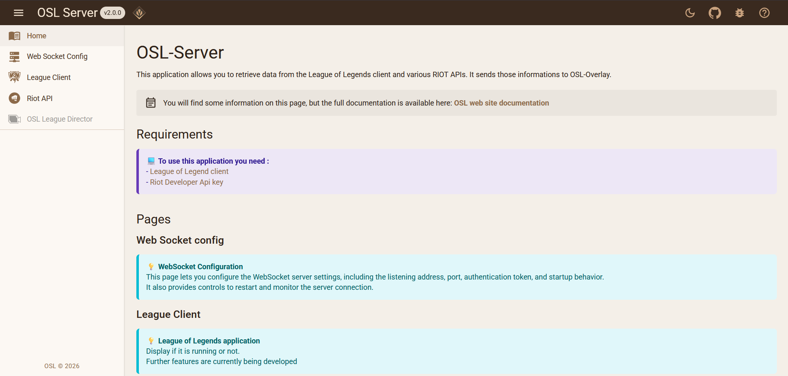
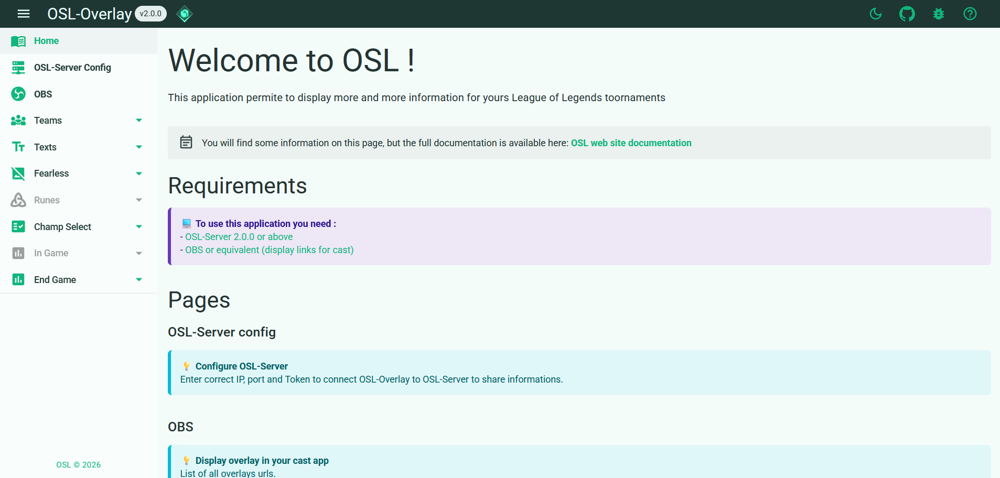
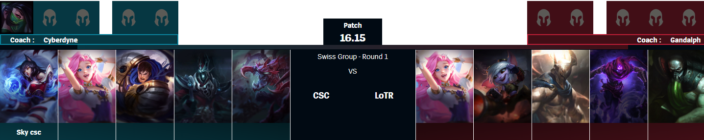
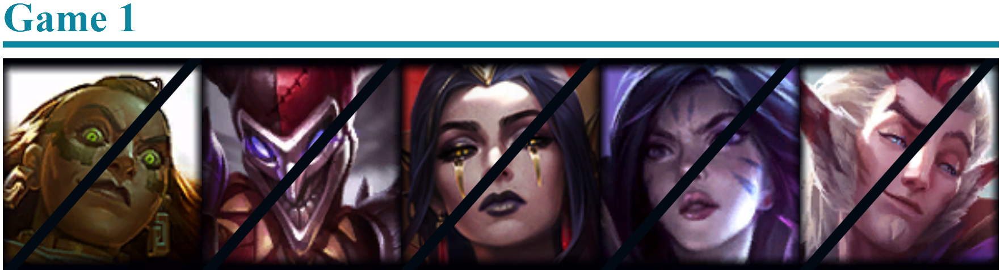
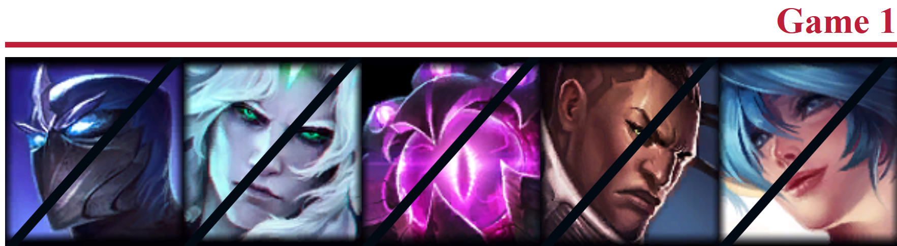
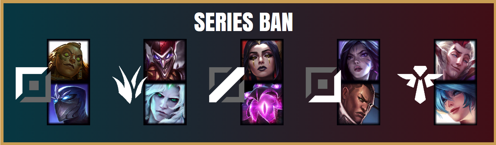
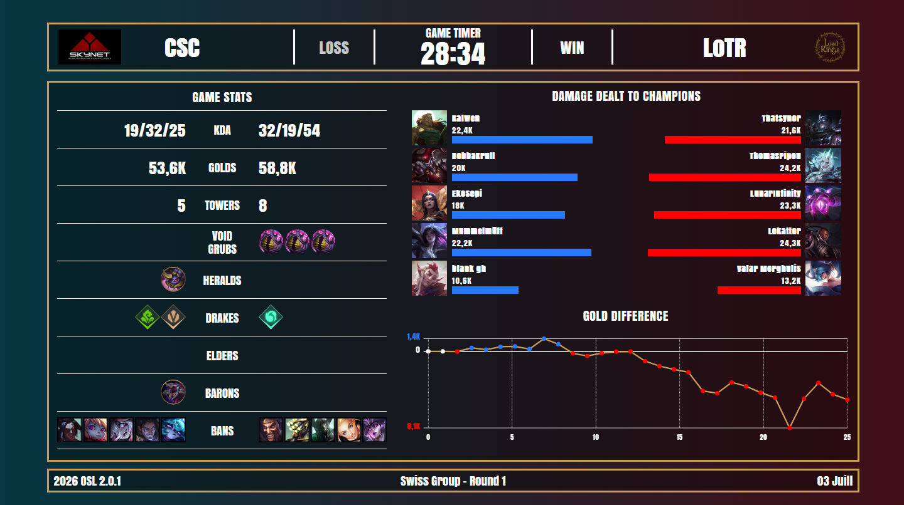
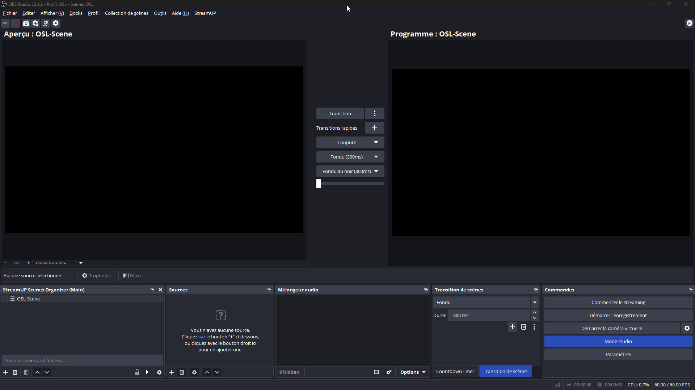

# **OSL : Overlay Spectator Live**

OSL is an free open-source project that provides tools and libraries for working with League of Legends game data and building real-time overlays.
The data recovery software and the overlay software are separate and can be deployed on multiple computer.

## **Features**

Is a short list of features, read [documentation](https://sky-csc.github.io/OSL/) for more information and tips.

### Available

* Champion Select overlay and customization
* Fearless overlay
* End Game overlay
* Manage team information (name, tag, coach, logo, player name, player picture)
* Display BO, Patch, Phase, Vs information (text)

### In Development

* New Champion Select overlays
* Fearless view customization
* End Game view customization
* New End Game overlays
    * Display more stats for one player (Runes, items, stats)
* Add In Game overlays
* Add Runes overlays

## **Repository**

Source code:

> **GitHub:** https://github.com/Sky-CSC/OSL/

## **Latest Release**

Download the latest stable version:

> **Latest Release:** https://github.com/Sky-CSC/OSL/releases/latest

## **OSL Server**

The OSL Server is responsible for collecting League of Legends data and distributing it to connected clients in real time. It acts as the central component of the platform, exposing game information through WebSockets for overlays and other applications.

> Home
> 

---

## **OSL Overlay**

The OSL Overlay is a web-based application that displays live game information received from the OSL Server. It provides a collection of customizable overlays.
> Home
> 

> Champ Select
> 

> Fearless
> 
> 
> 

> End Game
> 

## **Documentation**
Applications, riot api and installation documentation. **[Link documentation](https://sky-csc.github.io/OSL/)**

## **Getting Started**

### **Installation**

- Download [Latest Release](https://github.com/Sky-CSC/OSL/releases/latest)
- Run `OSL-Server.exe`, a web page opens automatically when the application is launched
- Run `OSL-Overlay.exe`, a web page opens automatically when the application is launched

The two applications do not need to be on the same computer to work. You just need to change the IP address and/or port in the dedicated web interface (OSL-Overlay -> OSL-Server Config).

### **OBS**
- Go to `OBS` web pages of `OSL-Overlay`
- Copy url on `OBS application`

> [!CAUTION]
> Use only http links, not https. OSB does not support https links.

> 

## **Thanks to these projets and community**
### [BlossomiShymae](https://github.com/BlossomiShymae)

[Needlework.Net](https://github.com/BlossomiShymae/Needlework.Net) (A .NET helper development tool for the LCU and Game Client!)

### [dysolix](https://github.com/dysolix)

[hasagi-types](https://github.com/dysolix/hasagi-types) (This repo hosts the auto-generated swagger.json and TypeScript types for the LCU API)

### [Floh22](https://github.com/floh22)

[LeagueBroadcast](https://github.com/floh22/LeagueBroadcast) (League of Legends Spectate Overlay Tools)

### [Riot Community Volunteers ](https://github.com/RCVolus)

[league-prod-toolkit](https://github.com/RCVolus/league-prod-toolkit) (Toolkit for League Productions with overlays for champion select, ingame events, end of game stats, and more)

[league-observer-tool](https://github.com/RCVolus/league-observer-tool) (An addition to the league-prod-toolkit for the observer PC)

[lol-pick-ban-ui](https://github.com/RCVolus/lol-pick-ban-ui) (Web-Based UI to display the league of legends champ select in esports tournaments)

### [Litzuck](https://github.com/Litzuck)

[lol-spectator-overlay-client](https://github.com/Litzuck/lol-spectator-overlay-client) (A client that produces an overlay similar to that of the one used in the broadcasts of LoL Esports during 2015-2017)

### [Piorrro33](https://github.com/piorrro33)

[overlay](https://github.com/piorrro33/overlay) (Customizable UI for League of Legends champion select spectating)

### [SkinSpotlights](https://github.com/SkinSpotlights)

[LiveEventsDocumentation](https://github.com/SkinSpotlights/LiveEventsDocumentation) (Minimalist documentation of live events)

## **License**
Distributed under the MIT License. See LICENSE for more information.

## **Legal disclaimer**
OSL isn't endorsed by Riot Games and doesn't reflect the views or opinions of Riot Games or anyone officially involved in producing or managing Riot Games properties. Riot Games, and all associated properties are trademarks or registered trademarks of Riot Games, Inc.

OSL was created under Riot Games' "Legal Jibber Jabber" policy using assets owned by Riot Games.  Riot Games does not endorse or sponsor this project.