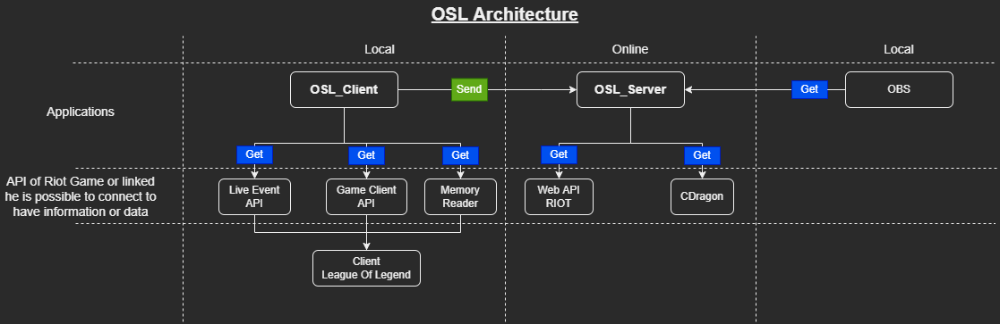

# **OSL : Overlay Spectator Live**

This project allows you to display an overlay with additional information for your League of Legends games

Applications use various APIs to collect information about the game, champions, players, .....

---

# **Features**

**[Champ Select :](https://sky-csc.github.io/OSL/web/index.html#information-display-with-overlay-in-champ-select)**
- 4 view
- Champ ban/select
- Summoners names
- Team name
- Number of victory/lose teams
- Timer ban/select/waiting
- Summoners Spell

**[In Game :](https://sky-csc.github.io/OSL/web/index.html#information-display-with-overlay-in-game)**

[With riot overlay :](https://sky-csc.github.io/OSL/web/index.html#with-riot-overlay-)
- 3 view
- Team/Dragon/Baron frame
- Team name
- Number of victory/lose teams
- Frame for video/logo/player picture ...

**[End Game :](https://sky-csc.github.io/OSL/web/index.html#information-display-with-overlay-in-end-game)**
- 3 view
- Team name
- Team score
- Team win loose
- Damage to champion
- Bans
- KDA/Gold/Tower/Dragon/Elder Dragon/Herald/Baron
- Gold Diff

**[Runes :](https://sky-csc.github.io/OSL/web/index.html#information-display-with-overlay-runes)**
- 7 view
- Top
- Jungle
- Mid
- Adc
- Support
- Adc and support
- All

 

---

# Applications architecture 

---

# Documentations.
- [**Client**](client/index.md)
> [!NOTE] 
> How to use and configure the application locally to sends information to the **Web** application
>
> How to set up and use riot spectator mode
>
> Code explanation.

- [**Web**](web/index.md)
> [!NOTE]
> How to use the web application and retrieve information and overlay from a game.
>
> Code explanation.

- [**Common**](common/index.md)
> [!NOTE]
> A library for interacting OSL project.
>
> Code explanation.

- [**CDragon**](cdragon/index.md)
> [!NOTE]
> A library for interacting with CDragon data.
>
> Code explanation.

- [**LcuApi**](lcuapi/index.md)
> [!NOTE]
> A library for interacting with League of Legends client.
>
> Code explanation.

- [**ReplayApi**](replayapi/index.md)
> [!NOTE]
> A library for interacting with league of legends client.
>
> Code explanation.

- [**WebApiRiot**](webapiriot/index.md)
> [!NOTE]
> A library for interacting with online riot api.
>
> Code explanation.

 

---

# Thanks to these projets and community
## [Floh22](https://github.com/floh22)

[LeagueBroadcast](https://github.com/floh22/LeagueBroadcast) (League of Legends Spectate Overlay Tools )

## [Riot Community Volunteers ](https://github.com/RCVolus)

[league-prod-toolkit](https://github.com/RCVolus/league-prod-toolkit) (Toolkit for League Productions with overlays for champion select, ingame events, end of game stats, and more)

[league-observer-tool](https://github.com/RCVolus/league-observer-tool) (An addition to the league-prod-toolkit for the observer PC)

[lol-pick-ban-ui](https://github.com/RCVolus/lol-pick-ban-ui) (Web-Based UI to display the league of legends champ select in esports tournaments)

## [Litzuck](https://github.com/Litzuck)

[lol-spectator-overlay-client](https://github.com/Litzuck/lol-spectator-overlay-client) (A client that produces an overlay similar to that of the one used in the broadcasts of LoL Esports during 2015-2017)

## [Piorrro33](https://github.com/piorrro33)

[overlay](https://github.com/piorrro33/overlay/tree/v1.5.1) (Customizable UI for League of Legends champion select spectating)

---

> [!WARNING] 
> **Project in progress** 

> [!TIP]
> **If you have any suggestions don't hesitate**

> [!TIP]
> **Distributed under the MIT License. See LICENSE for more information**

> [!WARNING]
> **Legal disclaimer**
> OSL isn't endorsed by Riot Games and doesn't reflect the views or opinions of Riot Games or anyone officially involved in producing or managing Riot Games properties. Riot Games, and all associated properties are trademarks or registered trademarks of Riot Games, Inc.
> OSL was created under Riot Games' "Legal Jibber Jabber" policy using assets owned by Riot Games.  Riot Games does not endorse or sponsor this project.