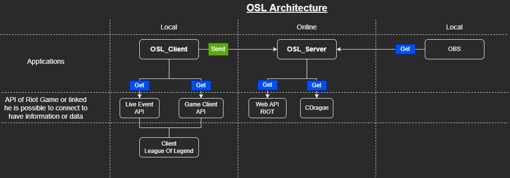

# Welcome to the OSL : **Overlay Spectator Live**

Here you'll find the OSL-Client and OSL-Server for the Overlay Spectator Live software suit.

## Applications architecture 

## For more information, please refer to these different documentations.
- [**Client**](/clientdoc/intro.html)
> [!NOTE] 
> How to use the app, what information he send att **Server**
- [**Server**](/serverdoc/intro.html)
> [!NOTE]
> How to use the app and retrive information. What is displayed, the information you can retrieve and display during the selection of champions, during the game and at the end of the game
- [**Developer Client**](/apiclient/index.html)
> [!NOTE]
> What information he send att **Server** in which data format, explenation of the code
- [**Developer Server**](/apiserver/index.html)
> [!NOTE]
> What information he recive to **Client** in which data format, explenation of the code

---

### This project permite to have an overlay for display informattion in champion-select, in-game and in end-game in streamings.

> [!WARNING] 
> **Project in progress** 

> [!TIP]
> **If you have any suggestions don't hesitate**

> [!CAUTION]
> **The license of this code is not given yet, it is coming soon**

> [!WARNING]
> **Legal disclaimer**
> OSL isn't endorsed by Riot Games and doesn't reflect the views or opinions of Riot Games or anyone officially involved in producing or managing Riot Games properties. Riot Games, and all associated properties are trademarks or registered trademarks of Riot Games, Inc.
> OSL was created under Riot Games' "Legal Jibber Jabber" policy using assets owned by Riot Games.  Riot Games does not endorse or sponsor this project.