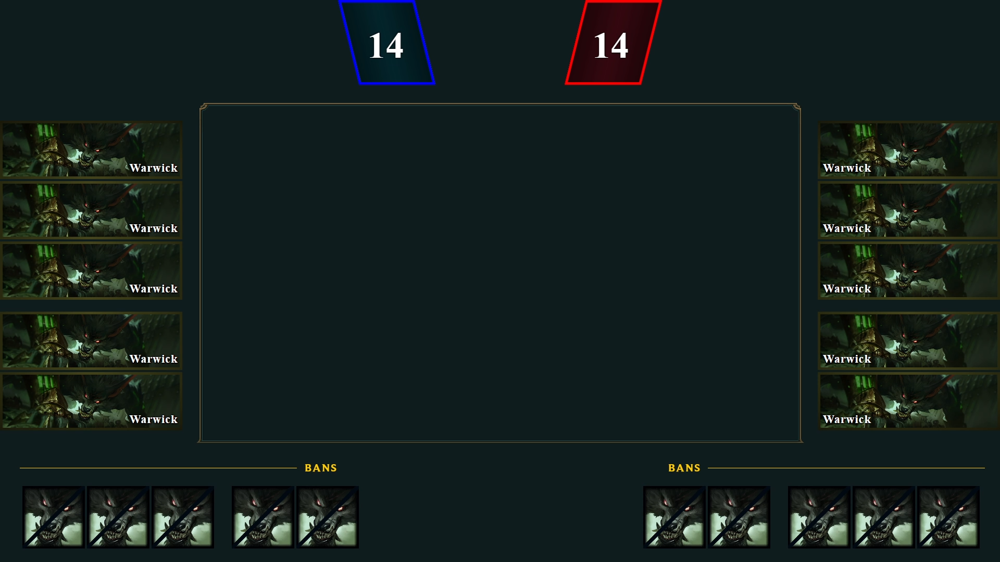
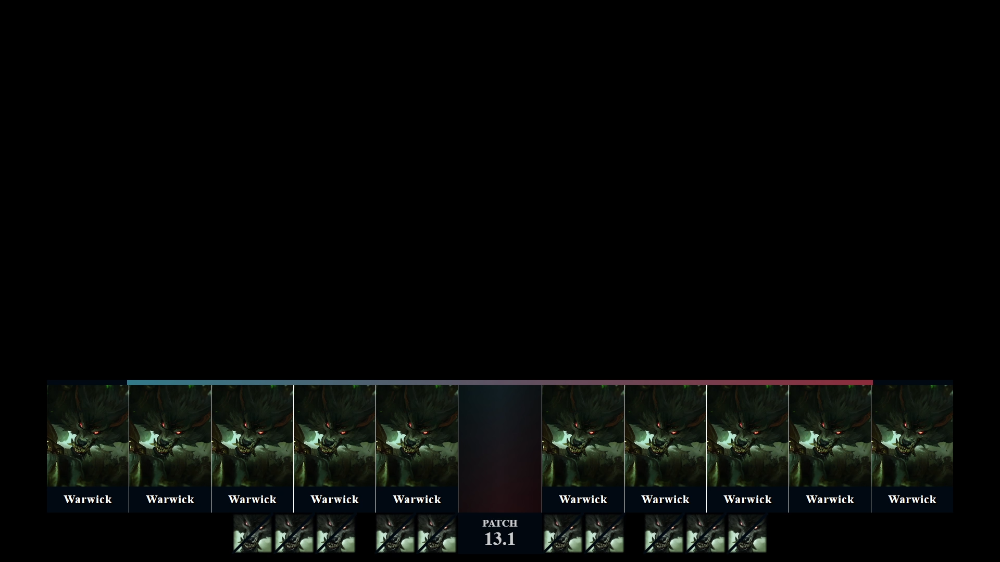
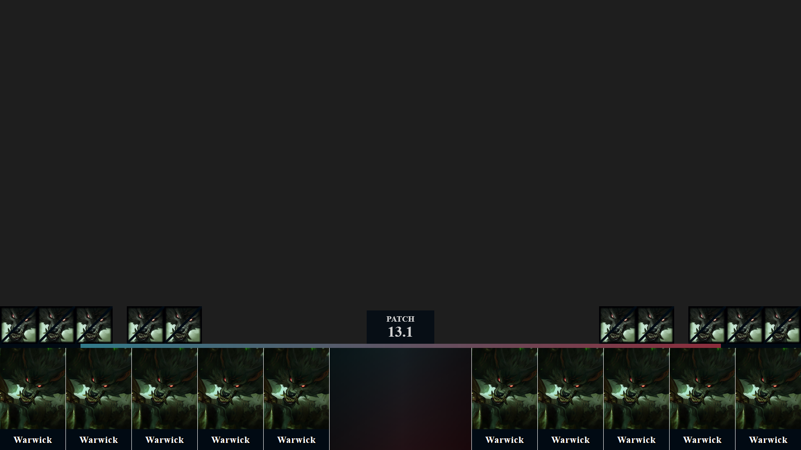
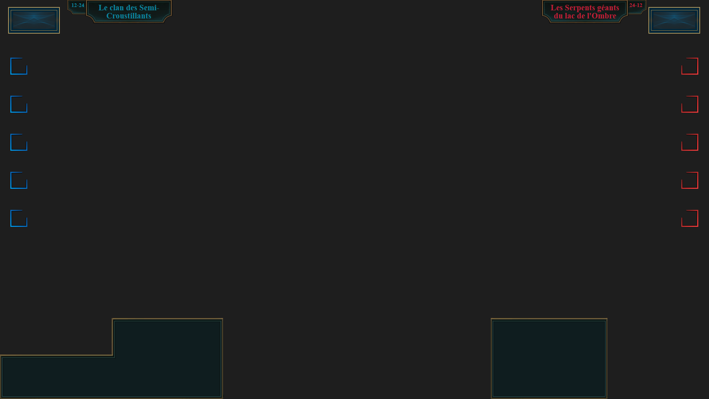
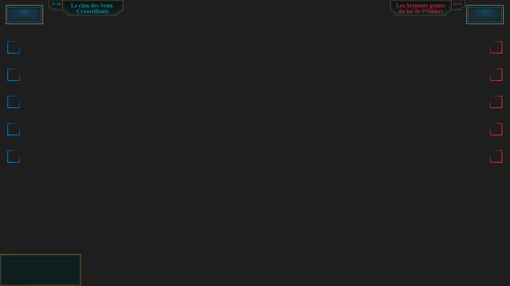

# **Server** Documentation

---

> [!CAUTION] 
> **Documentation in progress** 
> 
> **These features are under development, they are not available**

---

Download last release : [Release v1.0.0](https://github.com/Sky-CSC/OSL/releases/tag/v1.3.0)

Not forget run ```OSL-Server.exe```, before run ```OSL-Client.exe```

Open in a browser [https://< ip >:4242](https://ip:4242) (change ip by your computer ip)

Home : Link to documentation

CDragon : Data download from CDragon (When you run it he download data)

Config : Change port of OSL-Client, load or save champ select view config

Champ Select : Customization of overlay. When you run a game, information to OSL-Client is send to OSL-Server. 3 Overlay are usable

```Configuration/configCDragon.json``` : Configuration CDragon for download

```Configuration/configServerSocket.json``` : Port of server 
- Default port : 45678

```wwwroot/``` : 
- ```wwwroot/_content``` : Blazor operation
- ```wwwroot/assets``` : 
  - ```wwwroot/assets/xx.x``` : CDragon pictures downloads
  - ```wwwroot/assets/champselect``` : picture used for champion selection
  - ```wwwroot/assets/ingame``` : picture used for in game
  - ```wwwroot/assets/lolsprites``` : lol sprites
- ```wwwroot/css``` : css of web application
- ```wwwroot/favicon.ico``` : icon of web application
- ```wwwroot/OSL-Server.styles.css``` : css of web application

---

This document explains how to use and connect to the server to receive the different overlay.
The information you can receive from the game is listed, and separated into 5 categories. It is possible to disable or enable all options.

**Waiting a Game** : This overlay displays information about the players in the next game.

**Champ Select** : This overlay display information when champ select of the match is in progress.

**Waiting Game Start** :  This overlay displays information while waiting for the game to start because of the delay between the game and the broadcast for the viewers.

**In Game** : This overlay display information when spectator game is in progress.

**End Game** : This overlay display information when the game is over.

---

## **OBS** configuration :
Add to your différents scènes the différents URL (change ip by your local ip)

Champ Select :

```sh
http://ip:4141/champselect/view1
http://ip:4141/champselect/view2
http://ip:4141/champselect/view3
http://ip:4141/champselect/view4
```
<!-- 
<li> Champ Select :
<ul>

<li style="list-style-type: circle;">

```sh
http://ip:4141/champselect/view1
```

<li style="list-style-type: circle;">http://ip:4141/champselect/view2</li>
<li style="list-style-type: circle;">http://ip:4141/champselect/view3</li>
<li style="list-style-type: circle;">http://ip:4141/champselect/view4</li>
</ul>
</li> -->

In Game :

```sh
http://ip:4141/ingame/view1
http://ip:4141/ingame/view2
http://ip:4141/ingame/view3
```

End Game :

```sh
http://ip:4141/endgame/view1
http://ip:4141/endgame/view2
http://ip:4141/endgame/view3
```

Runes :

```sh
http://ip:4141/runes/top
http://ip:4141/runes/mid
http://ip:4141/runes/jungle
http://ip:4141/runes/adc
http://ip:4141/runes/supp
http://ip:4141/runes/adcsupp
http://ip:4141/runes/all
```

<!-- <li> In Game :
<ul>
<li style="list-style-type: circle;">http://ip:4141/ingame/view1
<li style="list-style-type: circle;">http://ip:4141/ingame/view2
<li style="list-style-type: circle;">http://ip:4141/ingame/view3
</ul>
</li> -->

<!-- Add to your différents scènes the différents URL, you can found this URL on your personal area, in games, game-xxxxxxxxxx, in **Waiting a Game**, **Champ Select**, **Waiting Game Start**, **In Game** and **End Game**.

The URL is like https://osl.sky-csc.fr/ezvozhebvized_jcbzekbcize_zebcjk54654_qsdd he is generate randomly -->

---

## Information display on overlay

<span style="color:yellow">information</span> : Display information if the default riot overlay is disabled

<span style="color:green">information</span> : Only if reading from memory is enabled. If memory reading is enabled, the default riot overlay can be disabled.

<span style="color:darkred">information</span> : Data not found at this time

<input type="checkbox" disabled checked> : Feature implemented

<input type="checkbox" disabled> : Feature not implemented, but in progress

<br>

### <ins>Information display with overlay **Waiting a Game**
<input type="checkbox" disabled>Number of lose and vircory in ranked solo/duo and flex

<!-- Video example Waiting a Game -->

<!-- https://youtu.be/46wy47H3D6o?list=PLk9GhrqI8Se0fgkxp_Ceb3V5A89m0kk4T -->
<!-- 
[](https://www.youtube.com/watch?v=46wy47H3D6o) -->

<!-- [](https://www.youtube.com/watch?v=y-jzB9q54Ng) -->

<!-- <a href="http://www.youtube.com/watch?feature=player_embedded&v=y-jzB9q54Ng?
" target="_blank"></a> -->

### <ins>Information display with overlay in **Champ Select**
Link to LoL client : 
<br><input type="checkbox" disabled checked>Champion Ban
<br><input type="checkbox" disabled checked>Champion Pick
<br><input type="checkbox" disabled checked>Summoners Name
<br><input type="checkbox" disabled checked>Summoners Spell (view 1)
<br><input type="checkbox" disabled>Skins
<br><input type="checkbox" disabled checked>Timer (ban/select/waiting)
 	
Personal information added :
<br><input type="checkbox" disabled>Name Toornament
<br><input type="checkbox" disabled checked>Win/Lose Team
<br><input type="checkbox" disabled>Logo Team
<br><input type="checkbox" disabled checked>Name Team
<br><input type="checkbox" disabled>Name Summoners
<br><input type="checkbox" disabled>Name Coach
<br><input type="checkbox" disabled>Stats Champ Ban
<br><input type="checkbox" disabled>Stats Champ Pick
<br><input type="checkbox" disabled>Stats Champ Winrate

**View 1 :**


<!--  -->

**View 2 :**


<!--  -->

**View 3 :**


<!--  -->

**View 4 :**


<!--  -->
<!-- Video example Champ Select

[](https://www.youtube.com/watch?v=46wy47H3D6o) -->

<br>

### <ins>Information display with overlay **Waiting Game Start**
<br><input type="checkbox" disabled>Stats of players in the champ pick
<br><input type="checkbox" disabled>Stats Summoners on champ

<!-- Video example Waiting Game Start

[](https://www.youtube.com/watch?v=46wy47H3D6o) -->
 
<br>

### <ins>Information display with overlay **In Game**

#### With riot overlay :

<br><input type="checkbox" disabled checked>Team frame
<br><input type="checkbox" disabled checked>Dragon frame
<br><input type="checkbox" disabled checked>Baron frame
<br><input type="checkbox" disabled checked>Name teams 
<br><input type="checkbox" disabled checked>Number of teams victory/lose
<br><input type="checkbox" disabled checked>Frame for video/logo/... 

**View 1 :**



**View 2 :**



**View 3 :**


<br>

#### Without riot overlay :

Inter of game :
<br><input type="checkbox" disabled>LevelUp
<br><input type="checkbox" disabled>Itemps buy
<br><input type="checkbox" disabled>Dragon (Kill, <span style="color:darkred">next</span>, soul)
<br><input type="checkbox" disabled>Elder Dragon (Timer, buff, all champ kill, <span style="color:green">gold diff</span>, <span style="color:green">damege diff</span>, next helder drake)
<br><input type="checkbox" disabled>Baron (buff, timer, all champ dead, <span style="color:green">gold diff</span>, <span style="color:green">damage diff</span>, next nash)
<br><input type="checkbox" disabled>Herald (buff, timer, launch or not, take or not)
<br><input type="checkbox" disabled><span style="color:yellow">Kill</span>
<br><input type="checkbox" disabled><span style="color:yellow">Tower</span>
<br><input type="checkbox" disabled><span style="color:yellow">Timer</span>
<br><input type="checkbox" disabled><span style="color:green">Gold</span>
<br><input type="checkbox" disabled><span style="color:green">Gold win during fight</span>
<br><input type="checkbox" disabled><span style="color:green">XP + Level</span>
<br><input type="checkbox" disabled><span style="color:darkred">Damage dead</span>
<br><input type="checkbox" disabled><span style="color:darkred">Damage dead during fight</span>

Exter of game :
<br><input type="checkbox" disabled>Ban/Pick
<br><input type="checkbox" disabled>Runes
<br><input type="checkbox" disabled>Logo team
<br><input type="checkbox" disabled>Team name
<br><input type="checkbox" disabled>Lose/Win
<br><input type="checkbox" disabled>Video

<!-- Video example In Game

[](https://www.youtube.com/watch?v=46wy47H3D6o) -->

<br>

### <ins>Information display with overlay in **End Game**
<br><input type="checkbox" disabled checked>Timer game
<br><input type="checkbox" disabled checked>Teams name
<br><input type="checkbox" disabled>Logo teams
<br><input type="checkbox" disabled checked>Champ dega
<br><input type="checkbox" disabled checked>KDA
<br><input type="checkbox" disabled checked>Total golds
<br><input type="checkbox" disabled checked>Tower
<br><input type="checkbox" disabled checked>Drake
<br><input type="checkbox" disabled checked>Elder dragon
<br><input type="checkbox" disabled checked>Herald
<br><input type="checkbox" disabled checked>Baron
<br><input type="checkbox" disabled checked>Ban
<br><input type="checkbox" disabled checked>Gold difference over time

**View 1 :**


**View 2 :**


**View 3 :**


<br>

### <ins>Information display with overlay **Runes**
<br><input type="checkbox" disabled checked>Summoner name
<br><input type="checkbox" disabled checked>Runes
<br><input type="checkbox" disabled checked>Top rune
<br><input type="checkbox" disabled checked>Jungle rune
<br><input type="checkbox" disabled checked>Mid rune
<br><input type="checkbox" disabled checked>Adc rune
<br><input type="checkbox" disabled checked>Support rune
<br><input type="checkbox" disabled checked>Adc and supp rune
<br><input type="checkbox" disabled checked>All lane rune


<!-- Video example End Game
[](https://www.youtube.com/watch?v=46wy47H3D6o) -->

